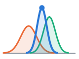
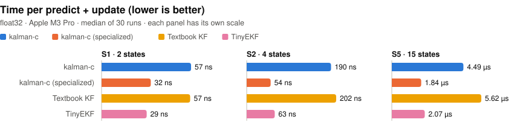
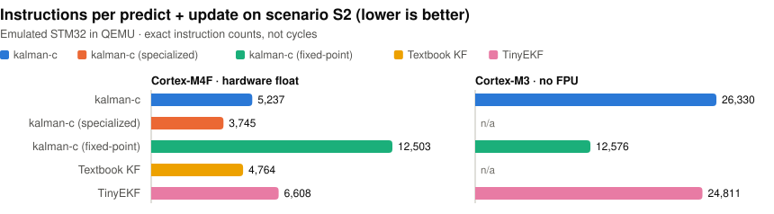
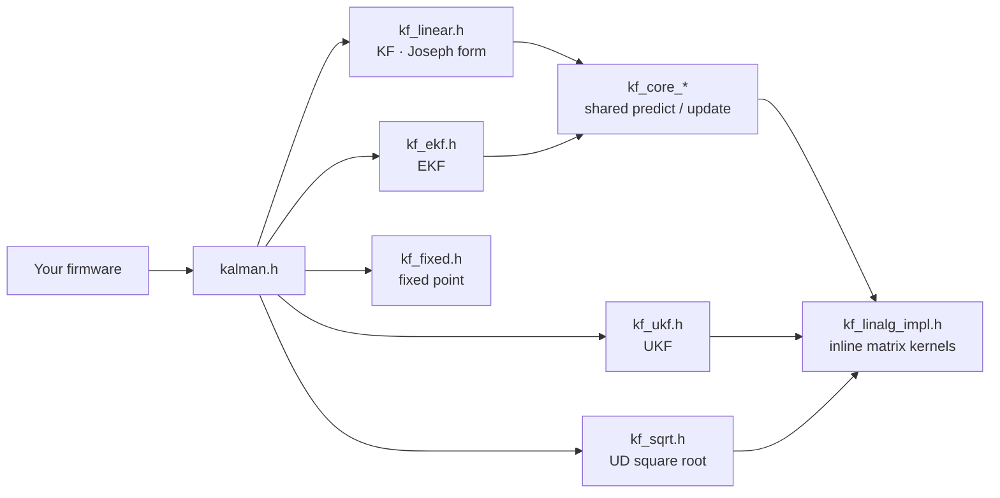

<p align="center">
  
</p>

<h1 align="center">kalman-c</h1>

<p align="center">
  <strong>Embedded-friendly Kalman filters in C99: no heap, no silent failures, and benchmarks to back it up</strong>
</p>

<p align="center">
  <a href="https://github.com/joslo2345/kalman-c/actions/workflows/ci.yml"></a>
  <a href="https://github.com/joslo2345/kalman-c/releases/tag/v0.1.0"></a>
  <a href="./LICENSE"></a>
  
  <a href="./scripts/check_misra.py"></a>
</p>

<p align="center">
  
  
  
  
</p>

<p align="center">
  <a href="#quick-start"><strong>Quick Start</strong></a> ·
  <a href="#highlights"><strong>Highlights</strong></a> ·
  <a href="#benchmarks"><strong>Benchmarks</strong></a> ·
  <a href="./examples"><strong>Examples</strong></a> ·
  <a href="#deep-dive"><strong>Documentation</strong></a> ·
  <a href="./CHANGELOG.md"><strong>Changelog</strong></a> ·
  <a href="https://github.com/joslo2345/kalman-c/releases"><strong>Releases</strong></a>
</p>

---

kalman-c is a Kalman filter library for microcontrollers and anything else that can't afford surprises.

- **Filters:** a linear KF, an EKF and a UKF; a UD square-root filter for badly conditioned problems; and a fixed-point filter for chips without an FPU.
- **Memory:** every filter runs in caller-owned memory, with no heap.
- **Errors:** a NaN, a singular covariance or an overflow returns an error code and leaves the filter exactly as it was.
- **Evidence:** every claim below is measured against [TinyEKF](https://github.com/simondlevy/TinyEKF) and a textbook filter on frozen scenarios, on the desktop and on emulated STM32 parts.

<p align="center">
  <picture>
    <source media="(prefers-color-scheme: dark)" srcset="docs/assets/bench-desktop-dark.svg" />
    
  </picture>
</p>
<p align="center">
  <picture>
    <source media="(prefers-color-scheme: dark)" srcset="docs/assets/bench-embedded-dark.svg" />
    
  </picture>
</p>

## News

<table>
  <tr>
    <td align="right" valign="top" width="110">
      <a href="./CHANGELOG.md#unreleased">
        
      </a>
    </td>
    <td valign="top">
      <strong>Square-root and fixed-point filters</strong><br/>
      <b>UD square-root KF/EKF</b>: Bierman update and Thornton predict. In float32 at R = 1e-10, its covariance error is 2.8e-7, against 1.4e-4 for the Joseph form.<br/>
      <b>Fixed-point KF</b>: integer-only, with overflow reported as an error. On a Cortex-M3 without an FPU it runs 1.9× fewer instructions than float on software floating point.<br/>
      <a href="./CHANGELOG.md#unreleased">Changelog →</a> ·
      <a href="./include/kalman/kf_sqrt.h">kf_sqrt.h →</a> ·
      <a href="./include/kalman/kf_fixed.h">kf_fixed.h →</a>
    </td>
  </tr>
  <tr>
    <td align="right" valign="top" width="110">
      <a href="https://github.com/joslo2345/kalman-c/releases/tag/v0.1.0">
        
      </a>
    </td>
    <td valign="top">
      <strong>🎉 First release</strong><br/>
      KF, EKF and UKF with Joseph-form updates, the single-header and Arduino packages, a PlatformIO manifest, and desktop and Cortex-M4F benchmarks.<br/>
      <a href="./CHANGELOG.md#010---2026-10-05">Changelog →</a> ·
      <a href="https://github.com/joslo2345/kalman-c/releases/tag/v0.1.0">Download →</a>
    </td>
  </tr>
</table>

## Highlights

<table align="center">
  <tr align="center" valign="top">
    <td width="33%">
      <strong>🚫 Zero Heap</strong><br/><br/>
      All state lives in a caller-owned struct sized at compile time. Two tests enforce it: one checks the library's symbol table, and one counts allocations at run time on Linux.<br/><br/>
      <a href="./include/kalman/kf_config.h">Sizing options →</a>
    </td>
    <td width="33%">
      <strong>🧮 Numerically Robust</strong><br/><br/>
      Joseph-form updates and Cholesky solves, with no explicit inverse. On an ill-conditioned problem in float32, kalman-c survives 1,000,000 steps; the textbook filter fails at step 0.<br/><br/>
      <a href="./tests/comparison/test_stability.c">Stability test →</a>
    </td>
    <td width="33%">
      <strong>🧭 KF · EKF · UKF</strong><br/><br/>
      One state struct and one calling pattern. EKF callbacks return the model and its Jacobian together; UKF callbacks need no Jacobian.<br/><br/>
      <a href="./examples/imu_attitude.c">IMU attitude example →</a>
    </td>
  </tr>
  <tr align="center" valign="top">
    <td width="33%">
      <strong>⚡ Fast When Specialized</strong><br/><br/>
      <code>KF_SPECIALIZE</code> compiles constant-size copies of the core. That beats TinyEKF on the 15-state and float32 4-state scenarios, and stays within 15% of it elsewhere.<br/><br/>
      <a href="#benchmarks">Benchmarks →</a>
    </td>
    <td width="33%">
      <strong>🎯 UD Square Root</strong><br/><br/>
      Bierman/Thornton factors never subtract to make a variance, so small variances stay accurate in float, up to about 800× better than the Joseph form at tiny R.<br/><br/>
      <a href="./include/kalman/kf_sqrt.h">kf_sqrt.h →</a>
    </td>
    <td width="33%">
      <strong>🔩 Fixed Point</strong><br/><br/>
      Integer-only Q-format with exact 64-bit accumulation. Overflow returns <code>KF_ERR_OVERFLOW</code>, never a wrap. Built for parts without an FPU.<br/><br/>
      <a href="./include/kalman/kf_fixed.h">kf_fixed.h →</a>
    </td>
  </tr>
  <tr align="center" valign="top">
    <td width="33%">
      <strong>🛡️ Errors Never Silent</strong><br/><br/>
      NaN or Inf input, a singular innovation, a failed model callback, corrupted sizes, overflow: each returns an error and leaves the filter byte-for-byte unchanged.<br/><br/>
      <a href="./tests/unit/test_errors.c">Error tests →</a>
    </td>
    <td width="33%">
      <strong>🔍 Statically Checked</strong><br/><br/>
      clang-tidy with every check an error, cppcheck, and an enforced subset of MISRA C:2012, run in CI along with sanitizer builds.<br/><br/>
      <a href="./scripts/check_misra.py">MISRA check →</a>
    </td>
    <td width="33%">
      <strong>📦 Easy to Drop In</strong><br/><br/>
      CMake target, a single-header <code>kalman_c.h</code>, an Arduino library zip, and a PlatformIO manifest. C++ callers work too.<br/><br/>
      <a href="#using-it-in-your-project">Integration →</a>
    </td>
  </tr>
</table>

## Benchmarks

Every library runs the same frozen scenarios with the same precision, initial state and noise matrices:

| Metric | Textbook KF | TinyEKF | kalman-c |
|---|---|---|---|
| **Heap allocations** | 0 | 0 | **0, enforced by tests** |
| **Covariance update** | (I − KH)P | (I − KH)P | **Joseph form, or UD square root** |
| **Ill-conditioned S4**<br>*float32, 1M steps* | ❌ fails at step 0 | ✅ survives¹ | **✅ survives** |
| **Filters** | KF | EKF | **KF · EKF · UKF · UD · fixed point** |
| **On error** | – | `ekf_update` returns false | **Error code; state unchanged** |
| **15-state S5**<br>*desktop, float32* | 5.45 µs | 2.03 µs | **1.84 µs** (specialized²) |
| **Instructions per step**<br>*Cortex-M4F, S2* | 4,764 | 6,608 | **3,745** (specialized²) |
| **Instructions per step**<br>*Cortex-M3, no FPU, S2* | – | 24,811 | **13,996** (fixed point) |
| **Peak stack**<br>*Cortex-M4F, S2* | 688 B | 740 B | **about 520 B** |

1. TinyEKF survives the frozen R = 1e-8 scenario but fails at step 3 when R = 1e-9 (`test_stability`). S4 uses 1e-8, so the table doesn't favour kalman-c.
2. `KF_SPECIALIZE` compiles constant-size copies of the core, as TinyEKF always does. The default build is 2–3× slower than TinyEKF. On the 2-state S1, the specialized build is about 10% slower (32 vs 30 ns).
3. These are a development laptop's timings (Apple M3 Pro, clang 21, `-O3`), indicative to within about 5%. Embedded figures are exact QEMU instruction counts, not cycles.
4. The textbook KF is [`naive_kf.c`](./tests/baselines/naive_kf.c), written for comparison: explicit inverse and the (I − KH)P update. The "–" cells weren't measured.

<details>
<summary><b>Methodology and scenarios</b></summary>

<br/>

| ID | Scenario | State / measurement | Steps |
|---|---|---|---|
| S1 | 1D constant velocity | 2 / 1 | 10,000 |
| S2 | 2D constant velocity | 4 / 2 | 10,000 |
| S3 | Range-bearing tracking (EKF, UKF) | 4 / 2 | 500 × 200 trials |
| S4 | Ill-conditioned: tiny R, large Q | 4 / 2 | 1,000,000 |
| S5 | 15-state INS error-state | 15 / 6 | 10,000 |

- **Scenarios** are frozen data files in [`tests/vectors/`](./tests/vectors), generated deterministically by [`scripts/gen_vectors.py`](./scripts/gen_vectors.py).
- **Desktop:** only predict+update is timed, as the median of 30 runs after a warm-up, on a development laptop (Apple M3 Pro, macOS 27.0.1, Apple clang 21.0.0, `-O3`). It isn't a frequency-locked benchmark machine: repeated runs agree within about 5%.
- **Embedded:** firmware images run the first 1,000 steps of S2.
  - Targets: an STM32F405 (Cortex-M4F, QEMU `netduinoplus2`) and an STM32F205 (Cortex-M3 without an FPU, QEMU `netduino2`).
  - Build: `arm-none-eabi-gcc` 14.2.1 at `-O2`, with sizes set to the problem (`KF_MAX_STATE=4`, `KF_MAX_MEAS=2`).
  - Metrics: instructions per step are counted exactly by a QEMU plugin, with the harness subtracted. Flash and RAM come from `arm-none-eabi-size`. Stack is a painted-stack high-water mark.
  - Cycle counts still need a real board.
- **Fixed point** on the desktop runs at Q13.18, so the S1 and S2 positions of up to about 5,254 fit. S5's 1e-6 variances are below that resolution, so S5 can't be represented in fixed point.
- **TinyEKF on the M4F** calls `sqrt()` on a double, which the single-precision FPU can't do in hardware, so its count includes software double math.
- **Reproduce** with the commands in [`CLAUDE.md`](./CLAUDE.md#commands). Charts are regenerated by [`scripts/make_readme_charts.py`](./scripts/make_readme_charts.py).

</details>

<details>
<summary><b>Full results table</b> (generated from <a href="./results/results.csv"><code>results/results.csv</code></a>)</summary>

<br/>

In this table, **Ours vs best other** compares the default build with the best baseline, and is above 1.00x when kalman-c is better. `@m3` marks the Cortex-M3 rows; `q18` and `q20` are fixed-point formats.

<!-- BENCH:START -->
| Scenario | Filter | Precision | Metric | kalman-c | kalman-c-specialized | naive | tinyekf | Ours vs best other |
|---|---|---|---|---|---|---|---|---|
| S1 | KF | float32 | max_abs_diff (state) | n/a | n/a | 0.0006461 | 0.0006499 | n/a |
| S1 | KF | float32 | rmse (state) | 0.2635 | 0.2635 | 0.2635 | 0.2635 | 1.00x |
| S1 | KF | float32 | time_per_step (ns) | 57.9 | 32.4 | 58.7 | 29.5 | 0.51x |
| S1 | KF | float64 | max_abs_diff (state) | n/a | n/a | 1.364e-12 | 9.095e-13 | n/a |
| S1 | KF | float64 | rmse (state) | 0.2635 | 0.2635 | 0.2635 | 0.2635 | 1.00x |
| S1 | KF | float64 | time_per_step (ns) | 64.7 | 33.5 | 58.3 | 29.7 | 0.46x |
| S1 | KF | q18 | max_abs_diff (state) | 0.0002443 | 0.0002443 | n/a | n/a | n/a |
| S1 | KF | q18 | rmse (state) | 0.2635 | 0.2635 | n/a | n/a | n/a |
| S1 | KF | q18 | time_per_step (ns) | 145.6 | 140.3 | n/a | n/a | n/a |
| S1 | SRKF | float32 | max_abs_diff (state) | 0.0006342 | 0.0006342 | n/a | n/a | n/a |
| S1 | SRKF | float32 | rmse (state) | 0.2635 | 0.2635 | n/a | n/a | n/a |
| S1 | SRKF | float32 | time_per_step (ns) | 60.1 | 59.8 | n/a | n/a | n/a |
| S1 | SRKF | float64 | max_abs_diff (state) | 1.364e-12 | 1.364e-12 | n/a | n/a | n/a |
| S1 | SRKF | float64 | rmse (state) | 0.2635 | 0.2635 | n/a | n/a | n/a |
| S1 | SRKF | float64 | time_per_step (ns) | 79.7 | 68 | n/a | n/a | n/a |
| S2 | KF | float32 | flash_bytes (bytes) | 1.165e+04 | 1.333e+04 | 1.072e+04 | 1.372e+04 | 0.92x |
| S2 | KF | float32 | instructions_per_step (instructions) | 5237 | 3745 | 4764 | 6608 | 0.91x |
| S2 | KF | float32 | max_abs_diff (state) | n/a | n/a | 0.0006533 | 0.0006056 | n/a |
| S2 | KF | float32 | ram_bytes (bytes) | 176 | 176 | 268 | 164 | 0.93x |
| S2 | KF | float32 | rmse (state) | 0.266 | 0.266 | 0.266 | 0.266 | 1.00x |
| S2 | KF | float32 | stack_bytes (bytes) | 520 | 516 | 688 | 740 | 1.32x |
| S2 | KF | float32 | time_per_step (ns) | 200.5 | 55.2 | 198.3 | 63.1 | 0.31x |
| S2 | KF | float32@m3 | flash_bytes (bytes) | 1.402e+04 | n/a | n/a | 1.536e+04 | 1.10x |
| S2 | KF | float32@m3 | instructions_per_step (instructions) | 2.633e+04 | n/a | n/a | 2.481e+04 | 0.94x |
| S2 | KF | float32@m3 | ram_bytes (bytes) | 256 | n/a | n/a | 164 | 0.64x |
| S2 | KF | float32@m3 | stack_bytes (bytes) | 648 | n/a | n/a | 780 | 1.20x |
| S2 | KF | float64 | max_abs_diff (state) | n/a | n/a | 3.258e-12 | 2.832e-12 | n/a |
| S2 | KF | float64 | rmse (state) | 0.266 | 0.266 | 0.266 | 0.266 | 1.00x |
| S2 | KF | float64 | time_per_step (ns) | 196.8 | 64.6 | 193.7 | 56.3 | 0.29x |
| S2 | KF | q18 | max_abs_diff (state) | 0.000273 | 0.000273 | n/a | n/a | n/a |
| S2 | KF | q18 | rmse (state) | 0.266 | 0.266 | n/a | n/a | n/a |
| S2 | KF | q18 | time_per_step (ns) | 632.2 | 619.7 | n/a | n/a | n/a |
| S2 | KF | q20 | flash_bytes (bytes) | 1.692e+04 | n/a | n/a | n/a | n/a |
| S2 | KF | q20 | instructions_per_step (instructions) | 1.433e+04 | n/a | n/a | n/a | n/a |
| S2 | KF | q20 | ram_bytes (bytes) | 176 | n/a | n/a | n/a | n/a |
| S2 | KF | q20 | stack_bytes (bytes) | 544 | n/a | n/a | n/a | n/a |
| S2 | KF | q20@m3 | flash_bytes (bytes) | 1.7e+04 | n/a | n/a | n/a | n/a |
| S2 | KF | q20@m3 | instructions_per_step (instructions) | 1.4e+04 | n/a | n/a | n/a | n/a |
| S2 | KF | q20@m3 | ram_bytes (bytes) | 176 | n/a | n/a | n/a | n/a |
| S2 | KF | q20@m3 | stack_bytes (bytes) | 544 | n/a | n/a | n/a | n/a |
| S2 | SRKF | float32 | flash_bytes (bytes) | 1.225e+04 | n/a | n/a | n/a | n/a |
| S2 | SRKF | float32 | instructions_per_step (instructions) | 4981 | n/a | n/a | n/a | n/a |
| S2 | SRKF | float32 | max_abs_diff (state) | 0.0009766 | 0.0009766 | n/a | n/a | n/a |
| S2 | SRKF | float32 | ram_bytes (bytes) | 296 | n/a | n/a | n/a | n/a |
| S2 | SRKF | float32 | rmse (state) | 0.266 | 0.266 | n/a | n/a | n/a |
| S2 | SRKF | float32 | stack_bytes (bytes) | 448 | n/a | n/a | n/a | n/a |
| S2 | SRKF | float32 | time_per_step (ns) | 166.4 | 165.2 | n/a | n/a | n/a |
| S2 | SRKF | float64 | max_abs_diff (state) | 1.364e-12 | 1.364e-12 | n/a | n/a | n/a |
| S2 | SRKF | float64 | rmse (state) | 0.266 | 0.266 | n/a | n/a | n/a |
| S2 | SRKF | float64 | time_per_step (ns) | 177.9 | 173.5 | n/a | n/a | n/a |
| S3 | EKF | float32 | nees (-) | 3.958 | 3.958 | n/a | 3.958 | – |
| S3 | EKF | float32 | rmse (state) | 0.2144 | 0.2144 | n/a | 0.2144 | 1.00x |
| S3 | EKF | float64 | nees (-) | 3.958 | 3.958 | n/a | 3.958 | – |
| S3 | EKF | float64 | rmse (state) | 0.2144 | 0.2144 | n/a | 0.2144 | 1.00x |
| S3 | UKF | float32 | nees (-) | 3.958 | 3.958 | n/a | n/a | n/a |
| S3 | UKF | float32 | rmse (state) | 0.2144 | 0.2144 | n/a | n/a | n/a |
| S3 | UKF | float64 | nees (-) | 3.958 | 3.958 | n/a | n/a | n/a |
| S3 | UKF | float64 | rmse (state) | 0.2144 | 0.2144 | n/a | n/a | n/a |
| S4 | KF | float32 | steps_to_failure (steps) | 1e+06 | 1e+06 | 0 | 1e+06 | 1.00x |
| S4 | KF | float64 | steps_to_failure (steps) | 1e+06 | 1e+06 | 1e+06 | 1e+06 | 1.00x |
| S4 | SRKF | float32 | steps_to_failure (steps) | 1e+06 | 1e+06 | n/a | n/a | n/a |
| S4 | SRKF | float64 | steps_to_failure (steps) | 1e+06 | 1e+06 | n/a | n/a | n/a |
| S5 | KF | float32 | max_abs_diff (state) | n/a | n/a | 0.0009766 | 0.0009766 | n/a |
| S5 | KF | float32 | rmse (state) | 0.06123 | 0.06123 | 0.06123 | 0.06123 | 1.00x |
| S5 | KF | float32 | time_per_step (ns) | 4597 | 1843 | 5452 | 2030 | 0.44x |
| S5 | KF | float64 | max_abs_diff (state) | n/a | n/a | 1.364e-12 | 1.364e-12 | n/a |
| S5 | KF | float64 | rmse (state) | 0.06123 | 0.06123 | 0.06123 | 0.06123 | 1.00x |
| S5 | KF | float64 | time_per_step (ns) | 4962 | 1914 | 5339 | 2156 | 0.43x |
| S5 | SRKF | float32 | max_abs_diff (state) | 0.0003052 | 0.0003052 | n/a | n/a | n/a |
| S5 | SRKF | float32 | rmse (state) | 0.06123 | 0.06123 | n/a | n/a | n/a |
| S5 | SRKF | float32 | time_per_step (ns) | 3371 | 3318 | n/a | n/a | n/a |
| S5 | SRKF | float64 | max_abs_diff (state) | 2.16e-12 | 2.16e-12 | n/a | n/a | n/a |
| S5 | SRKF | float64 | rmse (state) | 0.06123 | 0.06123 | n/a | n/a | n/a |
| S5 | SRKF | float64 | time_per_step (ns) | 3673 | 3652 | n/a | n/a | n/a |
<!-- BENCH:END -->

</details>

## Quick start

```c
#include <stdio.h>
#include "kalman/kalman.h"

int main(void) {
    const kf_real F[4] = {1, 1, 0, 1}; /* constant velocity, dt = 1 */
    const kf_real H[2] = {1, 0};       /* measure position only */
    const kf_real z[3][1] = {{1.1f}, {1.9f}, {3.2f}};
    kf_state kf;

    kf_init(&kf, 2, 1);            /* 2 states, 1 measurement; zeroes x, P, Q, R */
    kf.P[0] = kf.P[3] = 10;        /* initial uncertainty */
    kf.Q[0] = kf.Q[3] = 0.01f;     /* process noise */
    kf.R[0] = 0.25f;               /* measurement noise */

    for (int k = 0; k < 3; ++k) {
        if (kf_predict(&kf, F) != KF_OK || kf_update(&kf, z[k], H) != KF_OK) {
            return 1; /* the filter state is unchanged on error */
        }
        printf("position %.2f, velocity %.2f\n", (double)kf.x[0], (double)kf.x[1]);
    }
    return 0;
}
```

Matrices are flat, row-major arrays: element (i, j) of an n x n matrix is `A[i * n + j]`. For nonlinear models, see the EKF and UKF in `examples/imu_attitude.c`.


## Using it in your project

- **CMake:** `add_subdirectory(kalman-c)` and link the `kalman` target. Options: `KF_USE_DOUBLE`, `KF_MAX_STATE`, `KF_MAX_MEAS`, `KF_SPECIALIZE` and `KF_FX_FRAC`.
- **Single header:** download `kalman_c.h` from the [release](https://github.com/joslo2345/kalman-c/releases). Include it everywhere, and in exactly one `.c` file `#define KALMAN_C_IMPLEMENTATION` before including it.
- **Arduino:** install `kalman-c-arduino-<version>.zip` with *Sketch → Include Library → Add .ZIP Library*.
- **PlatformIO:** the repository includes a [`library.json`](./library.json).

> [!TIP]
> Size the library for your problem with `KF_MAX_STATE` and `KF_MAX_MEAS`. They set the size of `kf_state` and of the stack scratch space, so the defaults (12 and 6) waste RAM on a 4-state filter. If your sizes are fixed, list them in `KF_SPECIALIZE` for TinyEKF-class speed.

## Architecture



| Component | Responsibility |
|---|---|
| **`kf_linear.h`** | Linear KF. Predict, then a Joseph-form update in O(n²m), using the gain from a Cholesky solve. |
| **`kf_ekf.h`** | EKF on the same core. Callbacks return the model and its Jacobian, plus a `ctx` pointer. |
| **`kf_ukf.h`** | UKF with additive noise and Cholesky sigma points. `NULL` parameters select α = 1, β = 2, κ = 0, which is safe in float. |
| **`kf_sqrt.h`** | UD square-root KF/EKF. Bierman update, Thornton predict, and R whitened into scalar updates. |
| **`kf_fixed.h`** | Integer-only KF. Q-format `int32_t`, exact `int64_t` dot products, an integer square root, and overflow reported as an error. |
| **`kf_linalg.h`** | Public matrix routines. The filters use always-inline copies, so `KF_SPECIALIZE` can make sizes constant. |
| **`kf_config.h`** | Compile-time configuration: precision, maximum sizes, specializations. |

## Deep dive

- 📖 **API reference:** run `doxygen`, then open `build-docs/html/index.html`. The build fails on any undocumented public symbol.
- 🧪 **Examples:**
  - [1D tracking](./examples/constant_velocity.c) with the linear KF.
  - [IMU attitude](./examples/imu_attitude.c) from a gyroscope and an accelerometer, with both the EKF and the UKF.
- 📊 **Benchmarks:** [desktop harness](./bench), [Cortex-M firmware](./embedded) and [results](./results/results.csv).
- 🗺️ **Design plan:** [`kalman-c-repo-guide.md`](./kalman-c-repo-guide.md), the step-by-step plan this library follows.
- 📝 **Changelog:** [`CHANGELOG.md`](./CHANGELOG.md).

## Build and test

The tests compare against [TinyEKF](https://github.com/simondlevy/TinyEKF), which is included as a git submodule. Clone with `--recursive`, or run `git submodule update --init` after cloning.

```bash
cmake -B build                  # add -DKF_USE_DOUBLE=ON for double precision
cmake --build build
ctest --test-dir build --output-on-failure
```

CI builds with GCC and Clang, in float, double, specialized and fixed-point configurations, with AddressSanitizer and UBSan. It cross-builds the firmware for the Cortex-M4F and the Cortex-M3, and runs clang-format, clang-tidy, cppcheck and the MISRA check.

## Roadmap

| Item | Description |
|---|---|
| **Real-board cycle counts** | DWT cycle counts on a physical Nucleo-F4. The firmware is ready; only the measurement needs hardware. |
| **Fixed-point EKF** | Extend the integer-only filter beyond the linear KF. |
| **Package registries** | Publish to the PlatformIO registry and the Arduino Library Manager once the repository is public. |
| **Shared test vectors** | Move `tests/vectors/` into the shared repository the guide plans, for its C++, Python and Rust implementations. |

## Contributing

Bug reports and ideas are welcome in [GitHub Issues](https://github.com/joslo2345/kalman-c/issues). Before opening a pull request, run the tests and the static checks described in [`CLAUDE.md`](./CLAUDE.md). CI must pass, and any change to the numbers must come with re-run benchmarks.

## License

kalman-c is released under the [MIT License](./LICENSE).

It's built and measured with [TinyEKF](https://github.com/simondlevy/TinyEKF) (the comparison baseline), [Unity](https://github.com/ThrowTheSwitch/Unity) (the test framework), [QEMU](https://www.qemu.org/) (the Cortex-M emulation) and the [Arm GNU Toolchain](https://developer.arm.com/Tools%20and%20Software/GNU%20Toolchain).
